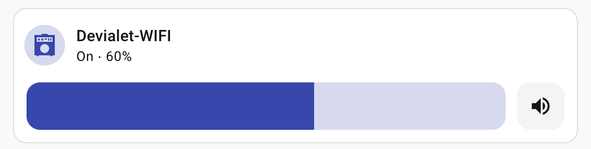

<!--
SPDX-FileCopyrightText: 2020 Dimitris Lampridis <dlampridis@gmail.com>

SPDX-License-Identifier: CC0-1.0
-->

# DeviMote
Unofficial remote control for Devialet Expert (non-Pro) amplifiers written in Python


## Home Assistant

A custom component is provided in `custom_components/devialet_expert_remote/`.
It exposes the amplifier as a **Media Player** entity with volume, mute, power,
and source selection.



### Network requirements

The amp broadcasts UDP status packets on port 45454. Home Assistant must be able
to receive these broadcasts. If HA is on a different subnet, configure a **UDP
broadcast relay** on your router/firewall to forward port 45454 broadcasts to the
HA host. Port 45455 (commands) must be reachable from HA to the amp — a standard
firewall allow rule is sufficient.

### Installation

Copy the component directory to your HA config and restart:

```bash
# add HA_SSH_TARGET=user@host to .env, then:
./deploy-ha-dev.sh
```

Or manually:

```bash
scp -r custom_components/devialet_expert_remote <user>@<ha-host>:/config/custom_components/
```

Then in HA: **Settings → Integrations → Add Integration → Devialet Expert (non-Pro) Remote**.

## CLI

Requires [uv](https://docs.astral.sh/uv/).

```bash
cp .env.example .env   # set DEVIALET_IP if needed (hostname or IP; auto-discovered if unset)
uv sync                # installs CLI dependencies
```

```bash
uv run devialet status              # show device status
uv run devialet volume -- -15.0    # set volume in dB (use -- before negative values)
uv run devialet mute                # toggle mute
uv run devialet power               # toggle power (on/standby)
uv run devialet source Toslink      # select source by name (case-insensitive partial match)
```

Example output of `devialet status`:

```
Device:  My Devialet
IP:      192.168.1.100
Power:   ON
Volume:  -12.0 dB
Muted:   No
Source:  Toslink (2)
Sources: Toslink (2), Phono (4), AES (5)
```

Volume is capped at -10 dB. The CLI will error if you try to exceed it.

## GUI


```bash
uv sync --group gui    # installs Kivy
uv run devialet-gui
```
